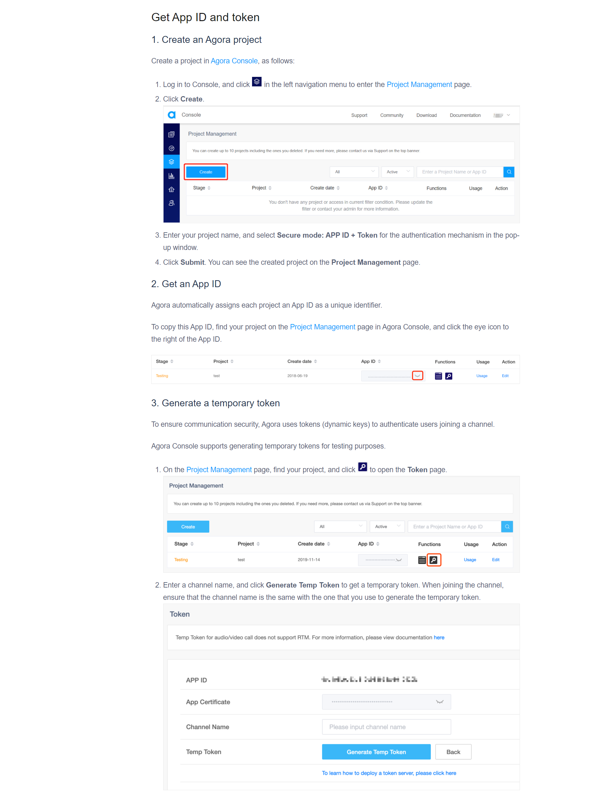

# Microsoft-Teams-Clone-Engage2021

**1. GENERATE THE TOKEN FOR THE APP** <br/><br/>
Here is the Link to the [Agora Console](https://dashboard.agora.io/signin/) <br/><br/>
 <br/><br/>

Use the Channel Name to enter the video room in the app.<br/><br/>

**2. ADD THE TOKEN TO THE APP** <br/><br/>
Open the settings.dart file in the msteams->lib->utils folder and add the app ID and the Token.

```dart
  const APP_ID = "";
  String Token = 'YOUR_TOKEN';
```
<br/>
Open the chatVideoCall.dart file in the msteams->lib->Chat folder and add the app ID and the Token.

```dart
  const APP_ID = "";
  const Token = 'YOUR_TOKEN';
```
